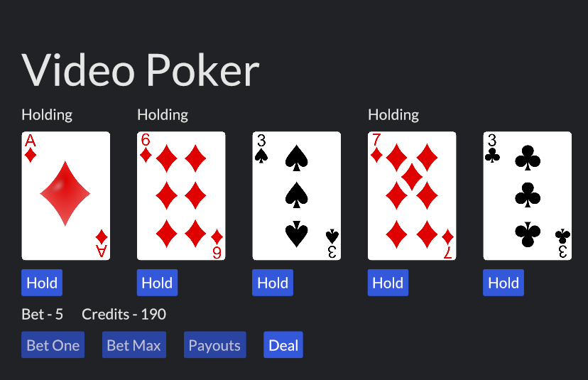
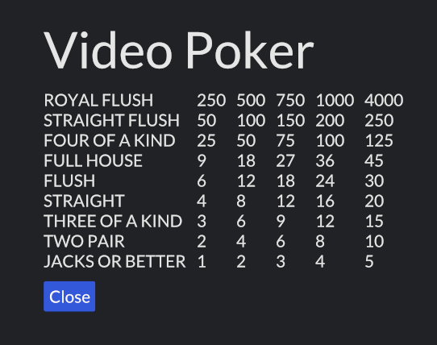

# Video Poker
Video Poker implemented in rust and iced

## Commands to Run
* git clone https://github.com/CodeOnARaft/VideoPoker.git
* cd videopoker
* cargo run

## Resources
Card Images from https://code.google.com/archive/p/vector-playing-cards/